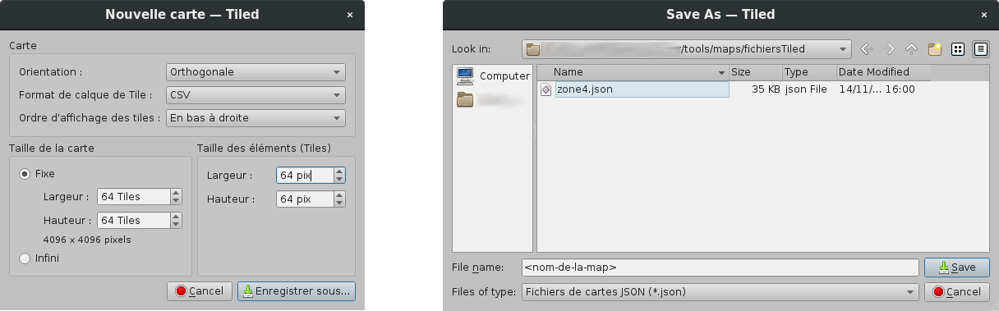

# Création/Modification et conversion d'un fichier de map

## Création/Modification d'une map avec le logiciel Tiled

- Afin de créer ou de modifier une map, il est nécessaire d'utiliser le logiciel [Tiled](https://www.mapeditor.org/) avec le tileset stocké dans le répertoire `tools/tilesets/`.
- Avant toute création ou modification de map, il faut au préalable ouvrir le tileset dans Tiled, en faisant `Fichier | Ouvrir...` (ou `Ctrl+O`) puis en sélectionnant le fichier `tileset.tsx` contenu dans le répertoire `tools/maps/tilesets/`.

### Création d'une nouvelle carte




- Commencez par réaliser les opérations suivantes : `Fichier | Nouveau > Nouvelle carte...`
- Laissez les paramètres de la section "Carte" tels quels (Orientation: Orthogonale, Format de calque de Tile: CSV, Ordre d'affichage des tiles: En bas à droite) et renseignez les dimensions de la carte à une taille fixe (l'écran du jeu a une dimension de 19 par 11 tiles, donc renseignez au moins ces valeurs).
- Enfin, vérifiez que la taille des éléments (Tiles) est bien de 64*64 pixels et cliquez sur `Enregistrer sous...`.
- Choisissez l'endroit où enregistrer le fichier map de Tiled (idéalement, avec les autres fichiers map existant dans `tools/maps/fichiersTiled/`) et vérifiez bien que vous sélectionnez l'extension `.json` (c'est primordial pour que le convertisseur arrive à convertir correctement le fichier).
- Enfin, cliquez sur `Sauvegarder`, puis vous pouvez passer à l'édition.

### Ouverture d'une map existante

- Ouvrez simplement le fichier map avec `Fichier | Ouvrir...` (ou `Ctrl+O`) depuis le répertoire `tools/maps/fichiersTiled/`.

### Édition d'une map

- Chaque map doit être constituée de deux couches, deux layers ; assurez vous donc que dans l'onglet `Calques` il y ait un premier calque nommé `sol` et un deuxième (au-dessus) du nom de `decoration` (n'hésitez par à les renommer ou à en créer de nouveau au besoin).
- Pour ajouter des blocs, cliquez simplement sur la tile correspondante dans l'onglet `Jeu de tuiles` et dessinez simplement la carte à l'aide de la souris.
- Une fois que vous êtes satisfait, enregistrez simplement les modifications avec `Fichier | Enregistrer` (ou `Ctrl+S`), puis vous pourrez passer à la conversion.

## Conversion et test d'un fichier map avec l'outil

### Utilisation du script de conversion

- Afin de convertir une fichier de map créé à l'aide du logiciel Tiled, il faut dans un premier temps exporter la carte dans le format JSON proposé par Tiled.
- Une fois en possession du fichier `.json` de la map, il suffit simplement de se placer dans le répertoire `/tools/maps/` et de lancer le script de conversion de map avec la commande suivante:
```bash
./conversion.py <chemin-vers-le-fichier-map.json>
```
- L'outil va ensuite demander quel nom donner à la map (ensuite utilisé pour nommer le fichier de sortie), il est également possible d'utiliser le nom du fichier passé en argument en appuyant simplement sur <Entrée>.
- Le fichier converti sera alors enregistré dans le répertoire `tools/maps/output/`, sous le nom donné et avec l'extension `.txt`.

### Test de la map nouvellement convertie

- Afin de tester la map fraichement convertie, il suffit simplement de copier le fichier de `tools/maps/output/` dans le répertoire `rsc/carte/` puis de lancer le jeu.
